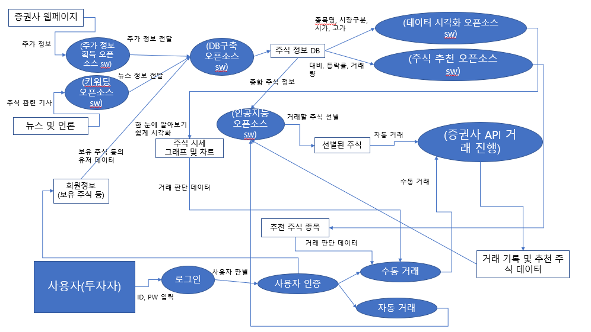

# 1. 소개

## 1-1. 이 문서의 목적

&nbsp;우리는 주식 투자에 있어 많은 관심을 가진 사람과 또 주식과 관련된 현업을 하는 사람, 또는 주식 투자에 입문하는 사람들을 위해 **통합 주식 투자 시스템**을 설계하고 그 설계과정을 설명하고자 전반적인 시스템 구조를 담은 시스템 설계서를 작성하게 되었다. 이 문서에서는 전반적인 **시스템의 설계동기**와, **설계목표**, **시스템 구조 및 설명**과 **유사 서비스 분석**, 사**용된 오픈소스에 대한 소개**, **시스템의 DFD**에 대해서 다룬다.

## 1-2. 이 문서의 범위

&nbsp;이 시스템을 설계하는 데 있어서 주식 관련 정보는 국내 언론사의 뉴스와 주식 투자 사이트, 증권사 홈페이지 등을 참조 하였으며, 서비스 설계에 있어 상용 소프트웨어는 사용하지 않고, 증권사 오픈 API 및 오픈소스 소프트웨어만을 사용하였다.

## 1-3. 가정

&nbsp; 시스템 사용에 있어 사용자(투자자)는 주식을 미리 보유하고 있으며 애플리케이션 이용을 위한 회원가입이 진행되어있어야한다. 각 주식 종목에 대한 정보가 풍부하게 제공되어(찾아 볼수 있으며) 있으며 주식의 매수와 매도에 있어서 충분한 자금을 가지고 있다고 생각해 시스템 동작에 문제가 없다고 가정한다.

# 2. 설계 개요

## 2-1. 배경 정보

&nbsp; 주식이란 회사의 자본을 구성하는 단위(출처: 네이버 어학사전)이며 우리는 관심있는 회사의 주식을 구매해 보유할 수 있고 구매한 주식을 다시 판매할 수 있다. 주식 투자란 간단히 그 주식의 구매(매수)와 판매(매도) 행위를 투자자의 적절한 판단으로 시세차익 및 배당금으로 이익을 보는 행위이다. 우리는 설계한 이 시스템을 이용하여 주식 투자의 이익률의 극대화를 이루어 내려고한다.

## 2-2. 설계 동기

&nbsp; 우리는 회사의 내부정보를 관련자 또는 내부자가 아닌 이상 접근하기 쉽지 않다. 그렇기에 투자자가 매수한 주식의 회사 정보는 언론의 뉴스나 인터넷, 신문 등의 공개 자료로 밖에 접근 할수밖에 없다. 그러한 자료들을 탐색에 드는 수고와 노력에도 불구하고 많은 자료를 찾는데 실패할 수 있으며 그로 인해 이익의 극대화를 위한 주식의 매수/매도 시점을 특정하기란 어렵다. 또한 시가, 고가, 대비, 등락 등의 표 데이터들은 시각화 되어있지 않아 한눈에 알아보기 어렵기에 분석에 보다 많은 노력이 필요하며 우리는 이런 단점들을 보완하고자 이 시스템을 설계하게 되었다. 주가에 영향이 갈만한 주식회사의 뉴스 정보만을 선별해 애플리케이션에 보여주고 여러 증권사 및 거래소 웹페이지의 주가 데이터들을 모아 db를 구축하고 시각화한다. 그리고 뉴스 및 주가 데이터를 투자자에게 전달하여 투자자로 하여금 주식 분석을 보다 쉽게할수 있게 한다. 또는 투자자가 직접 주가분석 할 필요없이 딥러닝을 통한 인공지능을 이용하여 자동 거래를 할수 있게 한다면 충분히 기존의 주식 거래에 차별점을 이끌어 낼수 있을것이라고 생각한다.

## 2-3. 설계 목표

&nbsp; 많은 뉴스나 주식 관련 데이터를 수집하는데 드는 비용과 노력을 줄이기 위해 웹페이지 스크롤링 오픈소스 소프트웨어를 사용하여 여러가지 주식 시세에 영향이 갈 만한 회사 소식 등의 정보를 얻어온뒤 그 데이터를 기반으로 시스템이 자동으로 매수와 매도를 거래하는 것이 목표이다. 그 거래 기록 및 데이터를 다시 인공지능에게 전달해 주식 매수/매도 판단의 한 데이터가 될 수있도록 제공하는 것 또한 목표이다.

# 3. 시스템 서비스 설명

&nbsp;위 가정 상황으로 생각한다.

## &nbsp; 1. 투자자가 애플리케이션에 로그인한다.

> ID, PW 어플리케이션에 전달, 회원 인증 후 로그인

## &nbsp; 2. 로그인한 투자자는 앱으로 부터 주식들의 시세들을 볼수 있으며, 특정 키워드가 포함된 뉴스 및 기사를 투자자에게 제공해 준다.

​    이 주가정보데이터를 db에 넣어 인공지능이 학습 할수 있는 데이터가 되도록 한다.

| 소식    | 시세   | ->   | 사용자    |
| ----- | ---- | ---- | ------ |
| 뉴스    | 현재가  | ->   | 시각 데이터 |
| 사내발표  | 등락가  | ->   | 시각 데이터 |
| 등등... |      |      |        |

## &nbsp; 3. 만약 주가 상승 등의 긍정적인 정보가 있다면 투자자에게 주식들을 선별해 추천해줄수 있도록 한다.

> 최근 가격상승이 높은 종목 -> 투자자에게 알림 등의 전달

## &nbsp; 4. 투자자는 애플리케이션으로부터 얻은 정보들을 바탕으로 주식 수동 거래 및 자동 거래를 진행할수 있다.

### &nbsp; 5. 수동 거래 진행시 증권사 api를 이용하여 직접 거래를 진행한다.

> 뉴스 및 추천 종목 -> 투자자 판단 -> 증권사 api -> 거래

## &nbsp; 6. 자동 거래 진행시 db를 이용해 이익의 극대화를 목표로한 학습을 통해 인공지능이 학습한 기준ex) 에 따라 주식 거래를 진행 할수 있게 한다.

> 학습된 인공지능 -> 인공지능 판단 -> 거래
>
> ex) 매도 : 최근 일주일간 가격 상승폭이 30% 이상 등)

## &nbsp; 7. 수동 및 자동으로 이루어진 거래의 기록이나 추천한 주식의 종목 같은 데이터들은 다시 인공지능에게 주어 새로운 학습데이터가 될 수 있도록 한다.

> 진행된 거래 경험 데이터 -> 인공지능에게 전달 -> 학습 데이터로 전환

# 4. 유사 서비스 분석

 담당하신 분이 작성 부탁드립니다

# 5. 사용한 오픈소스 소프트웨어 설명

## 1. 주가 정보 전달 오픈소스 소프트웨어 : beautifulSoup

- 오픈소스 링크 : https://beautiful-soup-4.readthedocs.io/en/latest/# 
- 오픈소스 설명 : 웹의 HTML파일을 크롤링하여 데이터를 추출하는 파이선 패키지
- 오픈소스 선정이유: beautifulsoup는 문서text를 가져오기에 크롤링이 빠르다. 따라서 시각적인 정보가 적은 주가 정보를 가져오는데 있어 적합하다고 생각하였다.
- 오픈소스 라이선스 : MIT LICENSE

#### 증권사 및 한국거래소(KRX)의 웹페이지에서 상장되어 있는 종목들의 시세 및 거래정보를 크롤링하여 얻은 주식 시세 관련 데이터를 DataBase에 저장하는 역할

> 제가 임의로 만든 양식입니다. 독자적인 양식과 이게 싫다하시는 분들은 따로 하셔도 아주 무방합니다. (이 문장은 설계서 완성시 지워야 합니다.)

## 번호. 오픈소스 역할 : 오픈소스 이름

- 오픈소스 링크 : URL
- 오픈소스 설명 : 
- 오픈소스 선정이유 : 
- 오픈소스 라이선스 : 

#### &nbsp; 사용된 오픈소스에 관한 자세한 설명

# 6. 시스템 DFD(Data Flow Diagram)

